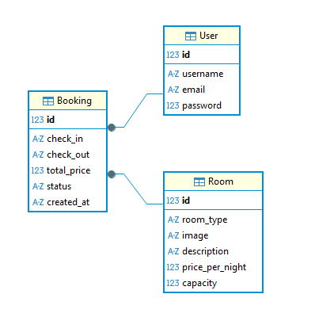

# a. Περιγραφή της εφαρμογής 
Η εφαρμογή αποτελεί ένα σύστημα online κρατήσεων για ξενοδοχείο, το οποίο επιτρέπει στους χρήστες να αναζητούν διαθέσιμα δωμάτια, να βλέπουν πληροφορίες σχετικά με αυτά και να πραγματοποιούν κρατήσεις μέσω διαδικτύου. Στόχος της εφαρμογής είναι η απλοποίηση της διαδικασίας κράτησης και η παροχή άμεσης πληροφόρησης για τη διαθεσιμότητα των δωματίων και τις παροχές αυτών, καθώς και διευκόλυνση χρηστών που επιθυμούν να πραγματοποιήσουν κράτηση διαδικτυακά αντί τηλεφωνικά, βελτιώνοντας έτσι και την εμπειρία αυτών.  

Οι κύριοι χρήστες της εφαρμογής, είναι πελάτες που επιθυμούν να κάνουν κράτηση στο ξενοδοχείο, καθώς και διαχειριστές που διαχειρίζονται τα δωμάτια και τις κρατήσεις. 

Η εφαρμογή παρέχει λειτουργίες όπως προβολή δωματίων, αναζήτηση δωματίων με ημερομηνίες, προβολή λεπτομερειών δωματίου, δημιουργία και διαχείρηση κρατήσεων, καθώς και προβολή ιστορικού κρατήσεων.

# b. Περιγραφή και τεκμηρίωση των βασικών λειτουργιών 
>Λειτουργία 1: Αναζήτηση Διαθεσιμότητας και Κράτηση Δωματίου (Κύρια Λειτουργική Οθόνη)
- **Περιγραφή**: Η κεντρική λειτουργική οθόνη της εφαρμογής επιτρέπει στον χρήστη να αναζητήσει άμεσα διαθέσιμα δωμάτια στο ξενοδοχείο "Hotel George" για ένα επιλεγμένο χρονικό διάστημα. Μέσω μιας φόρμας στην αρχική σελίδα, ο χρήστης εισάγει τις ημερομηνίες που επιθυμεί για να ελέγξει τη διαθεσιμότητα των δωματίων σε πραγματικό χρόνο.
- **Είσοδος χρήστη**:  
    Arrival: Ημερομηνία Άφιξης     
    Departure: Ημερομηνία Αναχώρησης  
    Κουμπί "Book Now": Υποβολή της φόρμας αναζήτησης  
- **Έξοδος**:
 Σε περίπτωση επιτυχίας: Η εφαρμογή επεξεργάζεται τα δεδομένα, φιλτράρει τις κρατήσεις στη βάση δεδομένων (db.sqlite3) και επιστρέφει τη λίστα με τα δωμάτια που είναι ελεύθερα για τις συγκεκριμένες ημερομηνίες. Σε περίπτωση σφάλματος: Αν ο χρήστης αφήσει κενά πεδία ή εισάγει λανθασμένες ημερομηνίες (π.χ. ημερομηνία αναχώρησης πριν από την άφιξη), η εφαρμογή διαχειρίζεται το σφάλμα και επιστρέφει κατάλληλο ενημερωτικό μήνυμα στην οθόνη χωρίς να διακόπτεται η λειτουργία της.
- **HTTP Method/URL**: 
    GET /(Αρχική σελίδα)  
- **Οθόνη/Mock-up**: index.html

>Λειτουργία 2: Εγγραφή χρήστη (Sign Up)
- **Περιγραφή**: Η εφαρμογή επιτρέπει σε νέους χρήστες να δημιουργήσουν λογαριασμό ώστε να αποκτήσουν πρόσβαση στις λειτουργίες του συστήματος, όπως η δημιουργία και διαχείριση κρατήσεων.
- **Είσοδος χρήστη**:  
    Username    
    Email    
    Password  
- **Έξοδος**:
Η εφαρμογή δημιουργεί νέο λογαριασμό χρήστη και σε περίπτωση επιτυχίας, ο χρήστης ανακατευθύνεται στην αρχική σελίδα (index) της εφαρμογής. Σε περίπτωση σφάλματος (ήδη υπάρχον username), εμφανίζεται αντίστοιχο μήνυμα.
- **HTTP Method/URL**: 
    GET /signup/ (φόρμα εγγραφής)  
    POST /signup/ (υποβολή στοιχείων)
- **Οθόνη/Mock-up**: signup.html

>Λειτουργία 3: Είσοδος χρήστη (Login)
- **Περιγραφή**: Η εφαρμογή επιτρέπει στον χρήστη να εισέλθει στο σύστημα χρησιμοποιώντας τα προσωπικά του στοιχεία (username και password), ώστε να αποκτήσει πρόσβαση σε λειτουργίες όπως η προβολή και διαχείριση των κρατήσεών του. 
- **Είσοδος χρήστη**:  
    Username      
    Password          
- **Έξοδος**: Σε περίπτωση επιτυχούς αυθεντικοποίησης, o χρήστης ανακατευθύνεται στην αρχική σελίδα (index) της εφαρμογής και εμφανίζεται σχετικό μήνυμα "ΓΕΙΑ ΣΟΥ, 'username' ". 
Σε περίπτωση αποτυχίας, δεν ανακατευθύνεται στην αρχική σελίδα και περιμένει εκ νεου την είσοδο στοιχείων, μέχρις ότου να χρησιμοποιηθούν σωστά στοιχεία σύνδεσης.
- **HTTP Method/URL**: GET /login/ (εμφάνιση φόρμας εισόδου)  
POST /login/ (υποβολή στοιχείων σύνδεσης)  
- **Οθόνη/Mock-up**: login.html

>Λειτουργία 4: Αποσύνδεση χρήστη (Logout)
- **Περιγραφή**: Η εφαρμογή επιτρέπει στον συνδεδεμένο χρήστη να αποσυνδεθεί από το σύστημα και να τερματίσει τη συνεδρία του.
- **Είσοδος χρήστη**:
Ενέργεια “Logout” από το μενού χρήστη.
- **Έξοδος**: Ο χρήστης αποσυνδέεται από το σύστημα και ανακατευθύνεται στην αρχική σελίδα.
- **HTTP Method/URL**: POST /logout/
- **Οθόνη/Mock-up**: Δεν απαιτείται ξεχωριστή οθόνη

>Λειτουργία 5: Προβολή προφίλ χρήστη
- **Περιγραφή**:
Η εφαρμογή επιτρέπει στον χρήστη να βλέπει βασικές πληροφορίες του λογαριασμού του. Επίσης παρέχεται η δυνατότητα αλλαγής/ενημέρωσης του κωδικού πρόσβασης (password) του χρήστη.
- **Είσοδος χρήστη**: Ο χρήστης πρέπει να είναι συνδεδεμένος.
- **Έξοδος**: Εμφανίζονται τα στοιχεία του χρήστη
    Όνομα Χρήστη   
    Email  
    Αλλαγή κωδικου πρόσβασης
- **HTTP Method/URL**: GET /profile/
- **Οθόνη/Mock-up**: profile.html

>Λειτουργία 6: Προβολή δωματίων
- **Περιγραφή**: Η εφαρμογή εμφανίζει στο χρήστη όλα τα διαθέσιμα δωμάτια του ξενοδοχείου. 
- **Είσοδος χρήστη**: Δεν απαιτείται καμία είσοδος από το χρήστη. 
- **Έξοδος**: Ένας πίνακας με τη λίστα δωματίων. Κάθε εγγραφή στον πίνακα περιλαμβάνει:  
    Εικόνα δωματίου  
    Τύπο δωματίου (μονόκλινο, δίκλινο κλπ)  
    Τιμή ανά βραδιά   
    Χωρητικότητα 
    Λεπτομέρειες δωματίου (περιγραφή δωματίου)
- **HTTP Method/URL**: GET /rooms_list/ 
- **Οθόνη/Mock-up**: rooms_list.html 

>Λειτουργία 7: Αναζήτηση δωματίων με ημερομηνίες
- **Περιγραφή**: Ο χρήστης επιλέγει ημερομηνίες και βλέπει διαθέσιμα δωμάτια. 
- **Είσοδος χρήστη**: 
    Arrival 
    Departure 
- **Έξοδος**: Λίστα διαθέσιμων δωματίων. Εάν ένα δωμάτιο δεν είναι διαθέσιμο για κάποιες ημερομηνίες, εμφανίζεται σχετικό μήνυμα για πιθανή μη διαθεσιμότητα. Αν οι ημερομηνίες δεν είναι έγκυρες (π.χ. Departure <= Arrival), εμφανίζεται μήνυμα σφάλματος.
- **HTTP Method/URL**: GET /rooms_list/?arrival=YYYY-MM-DD&departure=YYYY-MM-DD 
- **Οθόνη/Mock-up**: rooms_list.html 

>Λειτουργία 8: Φιλτράρισμα δωματίων
- **Περιγραφή**: Η εφαρμογή επιτρέπει στον χρήστη να φιλτράρει τα διαθέσιμα δωμάτια με βάση χαρακτηριστικά όπως τύπο δωματίου ή εύρος τιμής.
- **Είσοδος χρήστη**:
    Τύπος δωματίου (π.χ. μονόκλινο, δίκλινο)  
    Εύρος τιμής (Max τιμή)  
- **Έξοδος**: Λίστα δωματίων που πληρούν τα κριτήρια φίλτρου.
- **HTTP Method/URL**:
GET /rooms_list/?room_type=<room_type>&max_price=<max_price>
- **Οθόνη/Mock-up**: rooms_list.html

>Λειτουργία 9: Προβολή λεπτομερειών δωματίου
- **Περιγραφή**: Εμφανίζει στο χρήστη αναλυτικές πληροφορίες για ένα δωμάτιο. 
- **Είσοδος χρήστη**: Ο χρήστης επιλέγει δωμάτιο 
- **Έξοδος**:   
    Περιγραφή δωματίου           
- **HTTP Method/URL**: GET /room/\<int:room_id>\/ 
- **Οθόνη/Mock-up**: room_detail.html 

>Λειτουργία 10: Δημιουργία κράτησης
- **Περιγραφή**: Ο χρήστης πρέπει να είναι συνδεδεμένος. Αφού επιλέξει δωμάτιο και ημερομηνίες από την αναζήτηση, μεταφέρεται στη φόρμα ολοκλήρωσης της κράτησης. 
- **Είσοδος χρήστη**:   
    Ημερομηνία άφιξης        
    Ημερομηνία αναχώρησης      
- **Έξοδος**: Η εφαρμογή ελέγχει ότι arrival < departure. Ελέγχει αν υπάρχει ήδη κράτηση για το ίδιο δωμάτιο στο χρονικό διάστημα (arrival – departure). Αν το δωμάτιο είναι διαθέσιμο για τις επιλεγμένες ημερομηνίες, δημιουργείται η κράτηση και εμφανίζεται μήνυμα επιβεβαίωσης. Αν υπάρχει επικάλυψη ημερομηνιών, η κράτηση απορρίπτεται. 
- **HTTP Method/URL**: POST /book/\<int:room_id>\/ 
- **Οθόνη/Mock-up**: booking_form.html

>Λειτουργία 11: Προβολή κρατήσεων χρήστη
- **Περιγραφή**: Ο χρήστης βλέπει τις κρατήσεις του. 
- **Είσοδος χρήστη**: Ο χρήστης πρέπει να είναι συνδεδεμένος για να δει το προφιλ του "My Profile", στο οποίο φαίνονται οι κρατήσεις του.  
- **Έξοδος**: Ιστορικό κρατήσεων 
- **HTTP Method/URL**: GET /profile/ 
- **Οθόνη/Mock-up**: profile.html 

> Λειτουργία 12: Ακύρωση κράτησης
- **Περιγραφή**: Ο χρήστης ακυρώνει κράτηση που έχει πραγματοποιήσει
- **Είσοδος χρήστη**:     
    Επιβεβαίωση ενέργειας "Ακύρωση"     
- **Έξοδος**: Η κράτηση ακυρώνεται και το πεδίο "Κατάσταση" ενημερώνεται σε "Ακυρώθηκε".      
- **HTTP Method/URL**: POST /booking/cancel/\<int:booking_id>\/
-  **Οθόνη/Mock-up**: profile.html

> Λειτουργία 13: Προβολή λεπτομερειών ξενοδοχείου (About us) 
- **Περιγραφή**: Η εφαρμογή παρέχει πληροφορίες σχετικά με την ιστορία, τις εγκαταστάσεις και τις παροχές του ξενοδοχείου, βοηθώντας τον χρήστη να γνωρίσει το κατάλυμα.
- **Είσοδος χρήστη**: Δεν απαιτείται       
- **Έξοδος**: Εμφάνιση σελίδας με ιστορικό και περιγραφή του ξενοδοχείου, πληροφορίες για τις παροχές και
φωτογραφίες από τους κοινόχρηστους χώρους.     
- **HTTP Method/URL**: GET /about/
-  **Οθόνη/Mock-up**: about.html

# c. Σχήμα Βάσης Δεδομένων 
Η Βάση Δεδομένων (ΒΔ) της εφαρμογής αποτελείται από τους εξής πίνακες:

>Πίνακας: User 
- id (PK)
- username 
- email
- password

>Πίνακας: Room
- id (PK)
- room_type
- image
- description 
- price_per_night 
- capacity 

>Πίνακας: Booking
- id (PK)
- user_id (FK) 
- room_id (FK)
- check_in 
- check_out 
- total_price
- status
- created_at

**Σχέσεις**:
- User <-> Booking: Ένας χρήστης μπορεί να έχει πολλές κρατήσεις. (One-to-Many)
- Room <-> Booking: Ένα δωμάτιο μπορεί να αντιστοιχεί σε πολλές κρατήσεις. (One-to-Many) 

Σχήμα της ΒΔ (Entity-Relationship model) φτιαγμένο στο DBeaver

Σημείωση: Για τον Πίνακα 'User' δεν δημιουργήσαμε κλάση class User στα models, καθώς ο πίνακας δημιουργείται αυτόματα από το Django. Παρ'όλα αυτά θα μπορούσαμε.  
